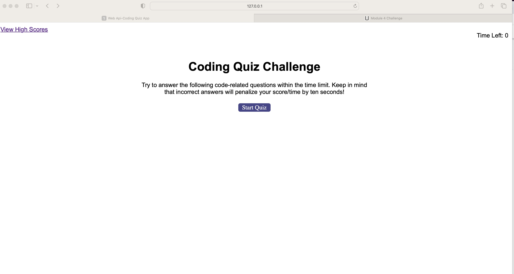
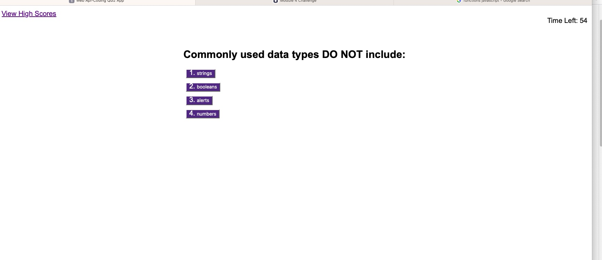
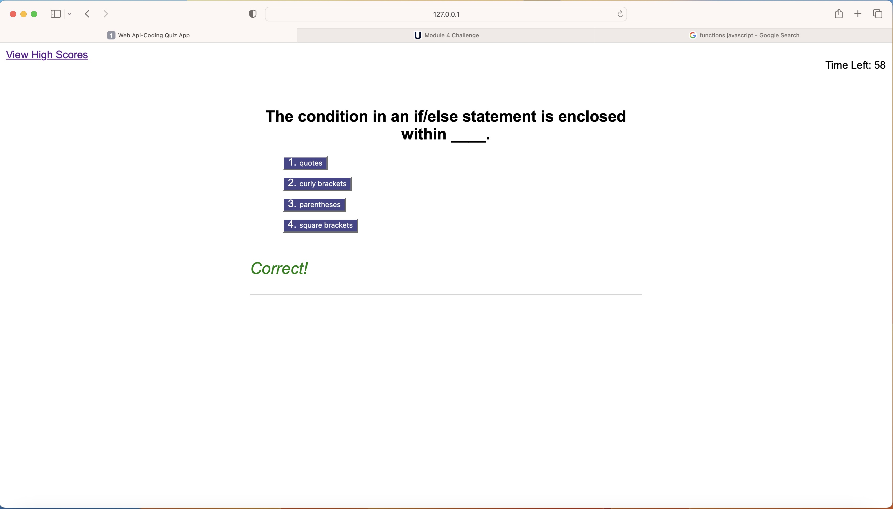
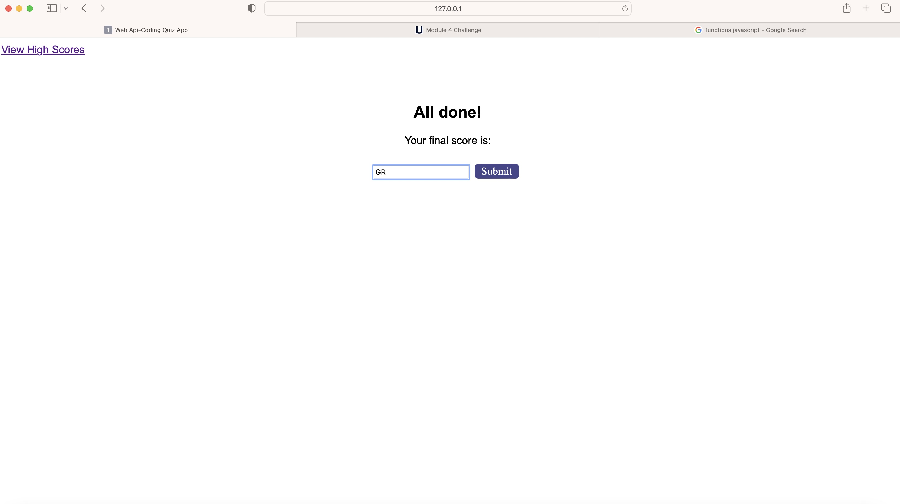
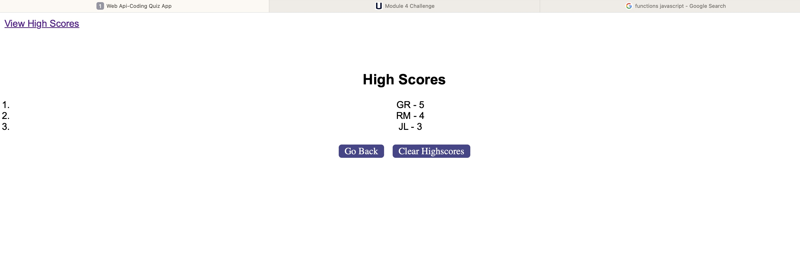

# gil-rosario-coding-quiz-app
## Description

The Coding Quiz app deployed within this repos will run in the browser, and will feature dynamically updated HTML and CSS powered by javascript code using DOMs. It will have a clean and polished user interface that is responsive. After clicking on the start quiz button, the app will populate coding questions on the screen with multiple choice answers in an ordered list format as buttons for the users to select. Once the quiz starts, a timer will begin given the quiz app user a certain time limit (60secs) to complete. See section **Usage** below for more information on how that app is used.

## Installation

This site was deployed using github pages. 
The following github documentation link was used to follow steps on deploying github pages: 

https://docs.github.com/en/pages/getting-started-with-github-pages/creating-a-github-pages-site

## Usage
To use the app, click on the deployed live url below. Once on the page, then click on the 'Start Quiz' button. 
You will then go through a series of questions based upon the following: 

 -  A timer starts (60secs timer) and you will be presented with a question
 -  Selection of multiple choice answers 
 -  After clicking on question, you will receive feedback on whether the choice was correct or wrong and next question will show up
 -  If Incorrect answer is selected, timer will be subtracted by 10secs
 -  Once all questions are answered or the timer reaches 0, the quiz ends
 -  Score will be capture and added to list of high scores page.
  

Link to deployed live URL [here.](https://grosario1.github.io/gil-rosario-coding-quiz-app/)

You can find code repo [here.](https://github.com/grosario1/gil-rosario-coding-quiz-app)

## Credits

N/A

## License

Please refer to the LICENSE in the repo.
